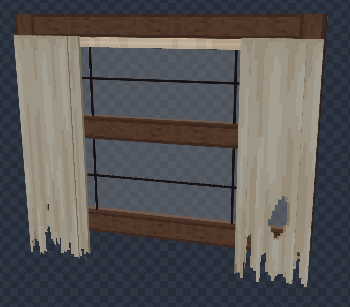
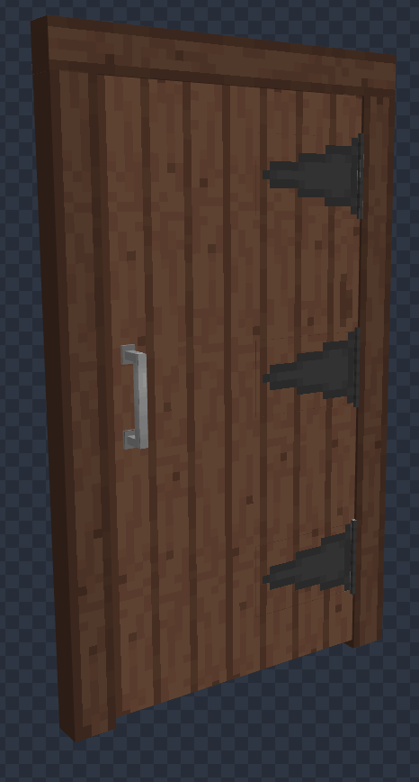

[i]All models are made by me in Blockbench[/i]
### Attic

### Attic Detail 1

### Attic Detail 2

### Radio

### Table

### Attic Ladder

### Bed

### Lantern

### Window Base

### Door

### Dresser

### Mothman Render

### In-Game Cabin Render

### In-Game Attic Render

